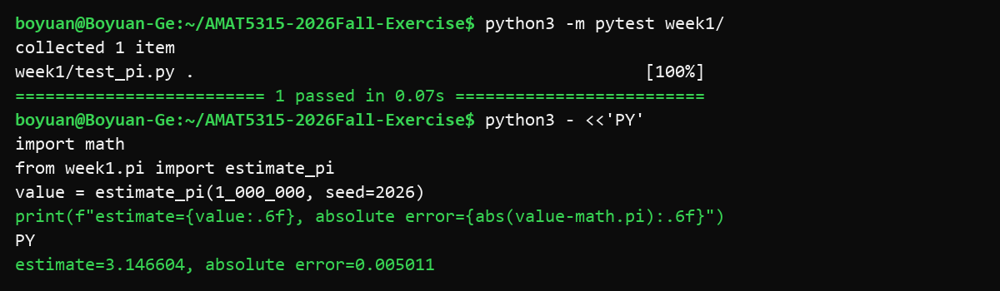

# AMAT5315 2026 Fall Exercises

This public repository contains Boyuan's weekly exercises and learning records for the AMAT5315 Modern Scientific Computing course.

## Weekly work

| Week | Topic | Documentation |
|---|---|---|
| [Week 1](week1/) | AI agents, Git, specification-first development, and a Monte Carlo estimate of pi | This README and [`week1/SPEC.md`](week1/SPEC.md) |
| [Week 2](week2/) | Molecular dynamics, numerical integration, profiling, and optimization | [`week2/README.md`](week2/README.md) |
| [Week 3](week3/) | Metropolis and Wolff Monte Carlo for the 2D Ising model | [`week3/README.md`](week3/README.md) |

Repository-level files stay at the top level intentionally:

- `AGENTS.md` stores shared repository memory and weekly-folder conventions.
- `setup.txt` records the coding-agent and Python versions used to initialize the coursework.
- `.gitignore` applies common ignore rules to the whole repository.

## Week 1 requirements

- Python 3.10 or newer
- `pytest`

Install the test dependency from the repository root:

```bash
python3 -m pip install pytest
```

## Reproduce the Week 1 test and pi estimate

Run the test:

```bash
python3 -m pytest week1/
```

Expected result: `1 passed`.

Then reproduce the numerical estimate and its absolute error:

```bash
python3 - <<'PY'
import math
from week1.pi import estimate_pi

value = estimate_pi(1_000_000, seed=2026)
print(f"estimate={value:.6f}, absolute error={abs(value - math.pi):.6f}")
PY
```

The committed implementation gives:

```text
estimate=3.146604, absolute error=0.005011
```

The error is below the required tolerance of `0.01`. The fixed seed makes the result repeatable.

## Week 1 evidence



The screenshot records both the passing test and the numerical estimate required by the Week 1 learning sheet.
