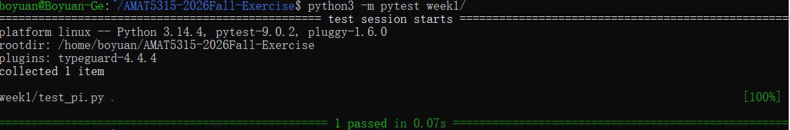

# AMAT5315 2026 Fall Exercises

This public repository contains Boyuan's weekly exercises and learning records for the AMAT5315 course.

## Requirements

- Python 3.10 or newer
- pytest

Install pytest with:

```bash
python3 -m pip install pytest
```

## Run the Week 1 test

From the repository root, run:

```bash
python3 -m pytest week1/
```

The expected result is `1 passed`.

## Test evidence



The screenshot shows the Week 1 test completing successfully with one passing test.
