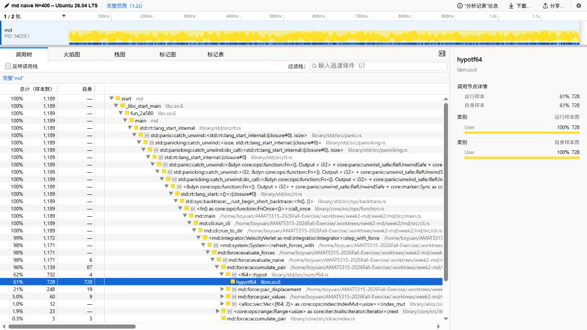
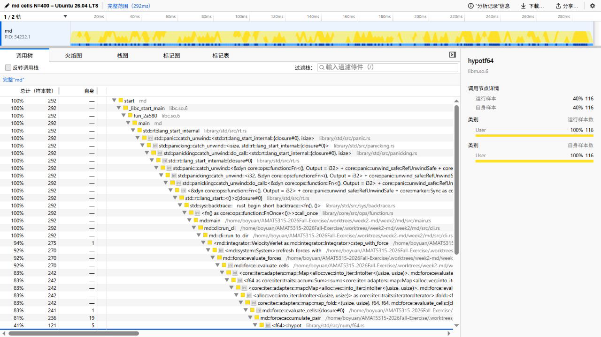
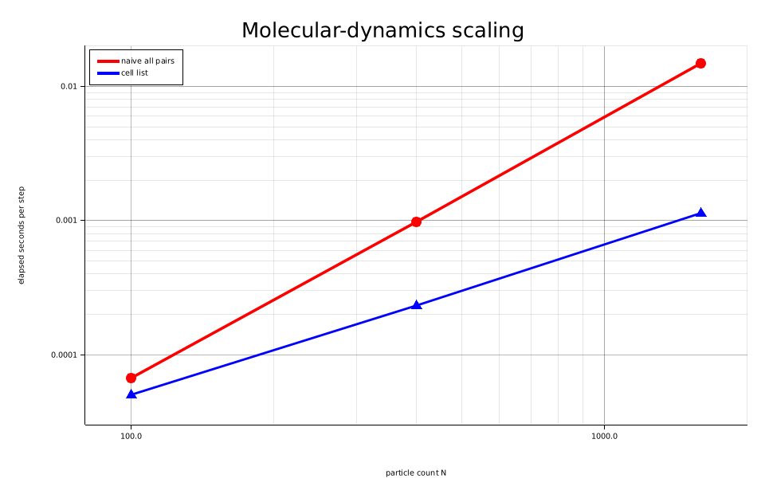

# Week 2: Molecular dynamics in Rust

## Reproduce the pair-field figure

From `week2/`:

```bash
cargo run --manifest-path md/Cargo.toml --release --example field -- field.png
```

The background color is the Lennard-Jones pair energy (red is repulsive,
blue is attractive). Arrows show the radial force direction.

## Reproduce the dimer integrator figure

From `week2/`:

```bash
cargo run --manifest-path md/Cargo.toml --release --example dimer -- dimer.png
```

Forward Euler evaluates both updates from the beginning of a step, so its
energy error grows sharply during close approaches. Velocity-Verlet uses two
half velocity updates around the position and force update; its energy error
remains bounded rather than drifting secularly.

## Reproduce the equilibrium run

From `week2/`:

```bash
make reproduce
cargo run --manifest-path md/Cargo.toml --release -- check artifacts
cargo run --manifest-path md/Cargo.toml --release -- video artifacts --out fluid.mp4
```

The checker recalculates the potential and kinetic energy from every saved
position and velocity before measuring secular drift, speed temperature, and
the Maxwell-Boltzmann speed-shape statistic.

## Timing

The course NumPy reference was downloaded from the supplied URL and timed
against this crate's debug and release binaries. Each entry is the median of
three wall-clock runs; the parenthesized values are the observed min-max range.

| implementation | three runs (s) | median (s) | range (s) |
|---|---:|---:|---:|
| course NumPy baseline | 4.99, 4.97, 4.99 | 4.99 | 4.97-4.99 |
| Rust debug | 2.32, 2.31, 2.31 | 2.31 | 2.31-2.32 |
| Rust release | 0.63, 0.63, 0.62 | 0.63 | 0.62-0.63 |

The release median is 27.3% of the debug median, comfortably below the required
one-third threshold. The measurements were generated from the repository root
with:

```bash
curl -fL -o week2/week2-sim.py \
  https://giggleliu.github.io/AMAT5315-2026Fall/downloads/week2-sim.py
python3 -m venv /tmp/amat5315-week2-venv
/tmp/amat5315-week2-venv/bin/python -m pip install numpy
cargo build --manifest-path week2/md/Cargo.toml
cargo install --path week2/md --locked --force
week2/scripts/benchmark.sh
```

The raw per-run measurements are retained in `benchmark-results.csv`.

## Profiles

Both profiles use `N=400`, 200 equilibration steps, and 1,000 production steps.
The force share is the inclusive sample percentage reported by the Samply Call
Tree. The complete-profile duration is read from the same view.

| force method | force function | inclusive force share | elapsed |
|---|---|---:|---:|
| naive | `evaluate_naive` | 98% | 1.2 s |
| cell list | `evaluate_cells` | 92% | 292 ms |

The naive profile is dominated by all-pairs force evaluation, as expected. The
cell-list run completes the identical workload in about one quarter of the
time. The recorded Call Trees are shown below.





The profiles can be recorded again with:

```bash
cargo install --locked samply
samply record --save-only --profile-name 'md naive N=400' \
  --output week2/profile-naive.json.gz \
  md run --force naive --n 400 --eq-steps 200 --steps 1000 \
  --out /tmp/amat5315-profile-naive
samply record --save-only --profile-name 'md cells N=400' \
  --output week2/profile-cells.json.gz \
  md run --force cells --n 400 --eq-steps 200 --steps 1000 \
  --out /tmp/amat5315-profile-cells
```

On Linux, Samply may require `kernel.perf_event_paranoid=1` while recording.

## Scaling benchmark

Each timing below covers 100 equilibration plus 500 production steps and is the
median of three release runs. Speedup is the naive median divided by the
cell-list median.

| N | naive median (range), s | cells median (range), s | speedup |
|---:|---:|---:|---:|
| 100 | 0.04 (0.04-0.04) | 0.03 (0.03-0.03) | 1.33x |
| 400 | 0.59 (0.59-0.59) | 0.14 (0.14-0.14) | 4.21x |
| 1,600 | 8.95 (8.94-8.95) | 0.68 (0.66-0.68) | 13.16x |

At fixed density and cutoff, the naive method checks every particle pair and
therefore grows quadratically, while the cell list visits only bounded nearby
candidate cells; this explains the widening slope difference and increasing
speedup.



The plot divides each median by 600 to show elapsed seconds per simulation step.
It is regenerated from the exact six table medians with:

```bash
cd week2
cargo run --manifest-path md/Cargo.toml --release --example scaling -- \
  scaling.png 0.04 0.59 8.95 0.03 0.14 0.68
```
