# Week 5 — automatic differentiation and checkpointed seismic imaging

This is a reproducible implementation of all four Week 5 exercises. The numerical wave step is differentiated by **Enzyme** in an isolated Rust kernel; JAX handles the Lennard–Jones AD experiments. All result figures are **embedded below**, not replaced by external links. The large input models and generated `.npy` arrays stay local; the source, license, checks, JSON records, and PNG evidence are committed.

## Reproduce everything

On Linux/WSL, install [uv](https://docs.astral.sh/uv/) and Rust/rustup, then run from this directory:

```bash
bash scripts/reproduce.sh
```

The script downloads the course's [fixed input archive](https://giggleliu.github.io/AMAT5315-2026Fall/downloads/week5-inputs.zip) if necessary, uses the pinned Python dependencies in `pyproject.toml` and `uv.lock`, builds `seismic` with `nightly-2026-09-05` and Enzyme, executes every run, audits the actions, and renders the plots. The full experiment and I/O contract is in `seismic.design.toml`. The course's Enzyme setup instructions are installed at `../.agents/skills/enzyme-setup/SKILL.md`. The model's redistribution notice is `MARMOUSI-LICENSE`.

## Part 1 — pair potential and AD modes

Producer: `uv run python scripts/ad_experiment.py`. It writes `artifacts/ad/derivatives.json`, `artifacts/ad/scaling.json`, and the four figures immediately below. At separation `r=1.3`, the energy is `-0.6570169144600472`, the forward and reverse derivatives are `2.239979929791143`, and the shared-node adjoint is `-2.3425903117359734`. On 601 samples, maximum absolute errors are `1.42e-14` for each handwritten AD mode and `4.66e-9` for centered finite differences. The gradient jaxpr shows `add_any` where contributions to the shared node are accumulated.

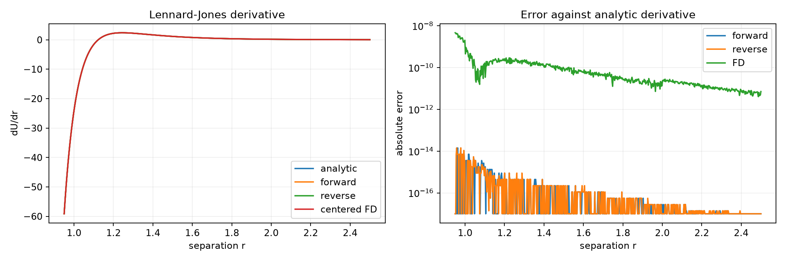

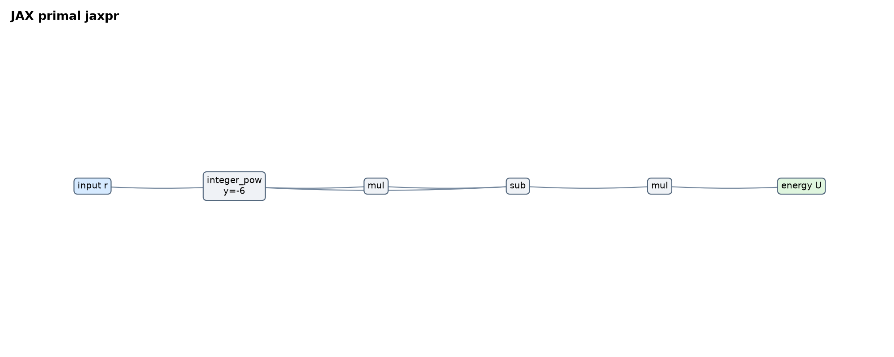

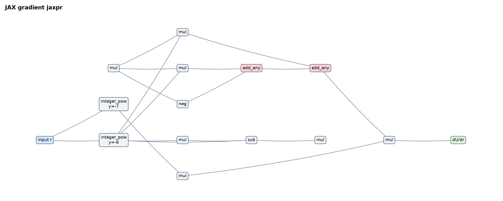

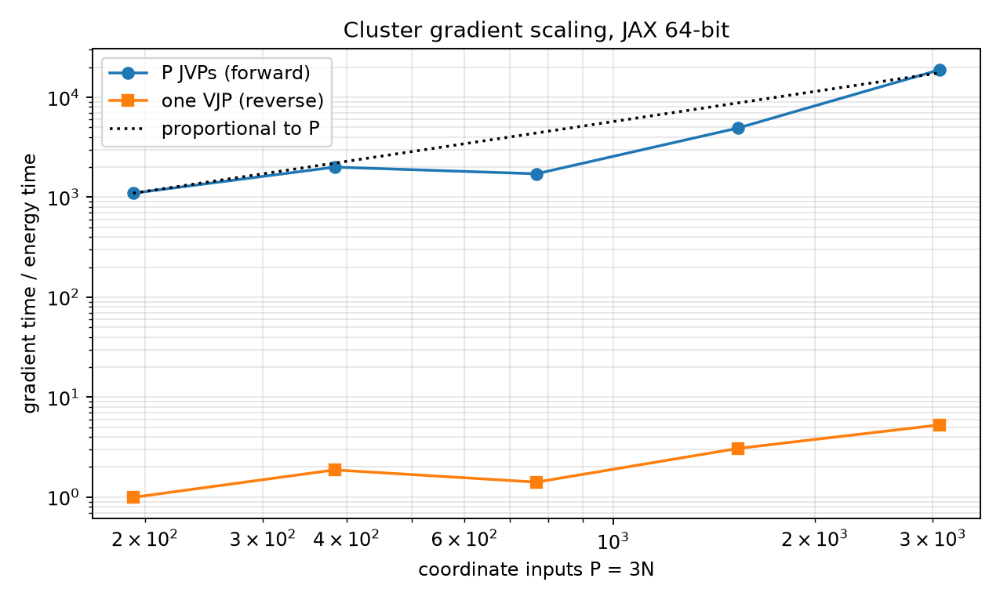

The cluster benchmark actually takes one JVP for each of the `3N` coordinates and one VJP for the scalar energy. At `N=1024`, the forward/reverse time ratio exceeds 100 on this CPU; both gradients agree to relative error `4.81e-16`. Exact timing measurements are in `artifacts/ad/scaling.json`.

## Part 2 — forward seismic propagation

Producer commands:

```bash
seismic/target/release/seismic --experiment inputs/reflector.json --mode forward --every 3 --out artifacts/forward
uv run python scripts/verify_and_plot.py
```

The solver creates `artifacts/forward/run.json`, `artifacts/forward/result.json`, and local-only `artifacts/forward/traces.npy`, `artifacts/forward/wavefield.npy`, `artifacts/forward/echo.npy`. The plotting script creates `artifacts/inputs.png`, `artifacts/forward/gathers.png`, `artifacts/forward/wavefield.png`, and `artifacts/forward/echo.png`.

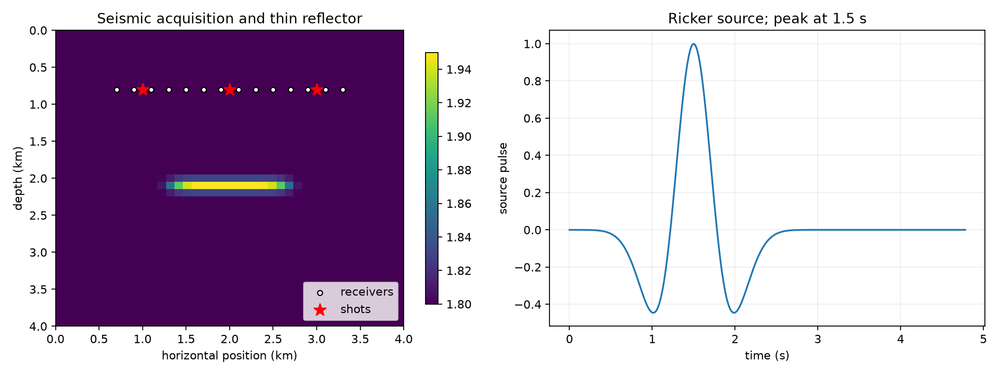

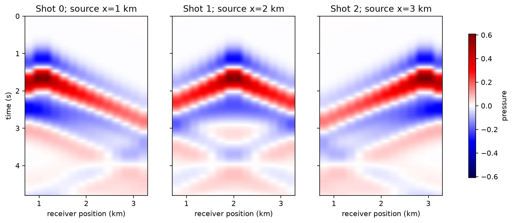

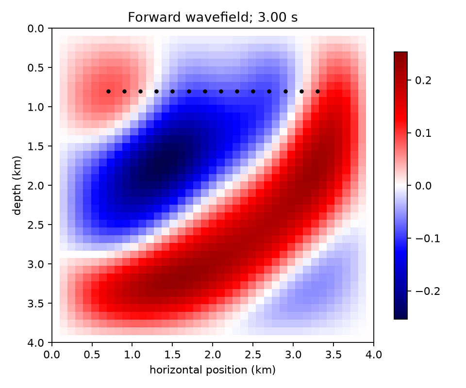

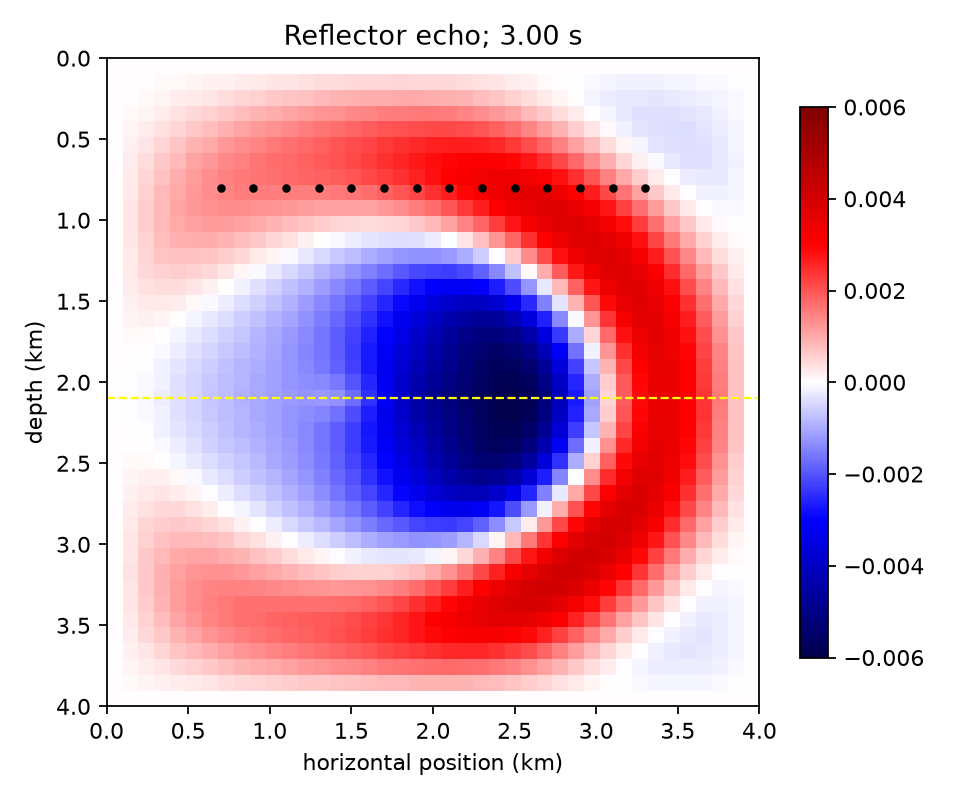

The total receiver-trace norm is `11.5747695036` (reference `11.574770`). Every shot has its largest pressure at trace index 83: `0.6080951434`, `0.5927139735`, and `0.6080951434`. At step 150 the echo reaches `0.006005`, versus `0.253518` in the full field; that is why the echo is difficult to see without subtraction.

## Part 3 — Enzyme Born JVP and full-history VJP

Producer commands:

```bash
seismic/target/release/seismic --experiment inputs/reflector.json --mode born --out artifacts/born
seismic/target/release/seismic --experiment inputs/reflector.json --mode adjoint --data artifacts/born/born_data.npy --every 3 --out artifacts/adjoint
uv run python scripts/verify_and_plot.py
```

The Born run creates `artifacts/born/run.json`, `artifacts/born/result.json`, and local-only `artifacts/born/born_data.npy`. The reverse run creates `artifacts/adjoint/run.json`, `artifacts/adjoint/result.json`, and local-only `artifacts/adjoint/image.npy`, `artifacts/adjoint/wavefield.npy`. The plotting script creates `artifacts/adjoint/image.png` and `artifacts/adjoint/wavefield.png`.

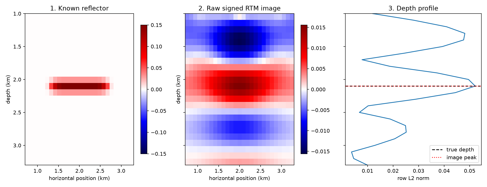

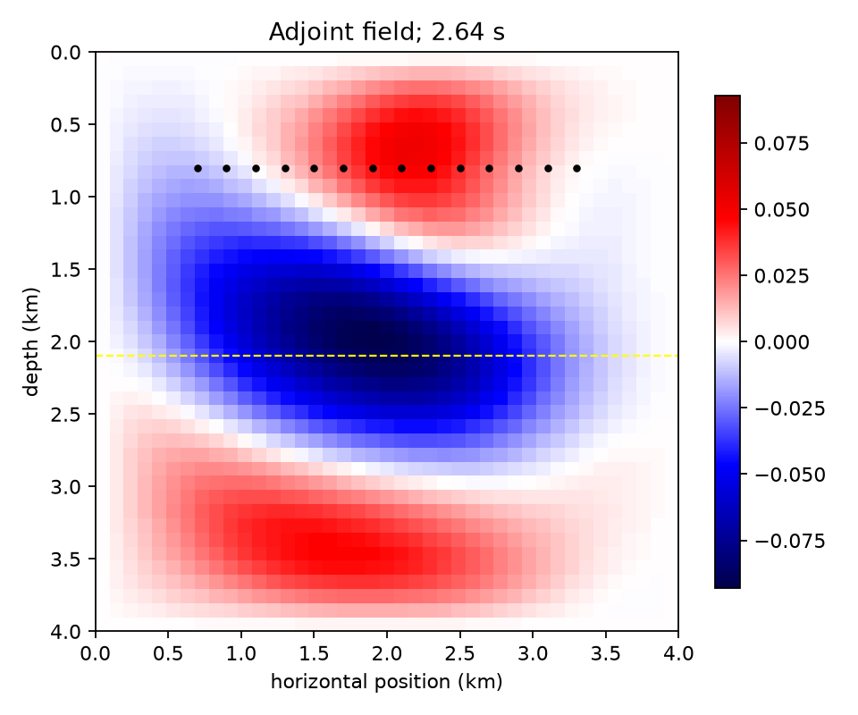

The transpose check gives `sum((Jm)^2) = 0.034847890215163775` and `sum(m * JᵀJm) = 0.03484789021516376`, a relative difference of `3.98e-16`. The image's row norm peaks exactly at `z=21`, or `2.1 km`.

## Part 4 — Treeverse checkpointing and Marmousi

Producer commands:

```bash
for b in 1 3 5 10; do
  seismic/target/release/seismic --experiment inputs/reflector.json --mode adjoint --data artifacts/born/born_data.npy --storage treeverse --checkpoints "$b" --out "artifacts/checkpoint-$b"
done
seismic/target/release/seismic --experiment inputs/marmousi.json --mode born --out artifacts/marmousi-born
seismic/target/release/seismic --experiment inputs/marmousi.json --mode adjoint --data artifacts/marmousi-born/born_data.npy --storage treeverse --checkpoints 5 --out artifacts/marmousi-image
uv run python scripts/verify_and_plot.py
```

For each budget `b = 1, 3, 5, 10`, the reflector run creates `artifacts/checkpoint-b/run.json`, `artifacts/checkpoint-b/result.json`, local-only `artifacts/checkpoint-b/image.npy`, and **three separate** `artifacts/checkpoint-b/actions-0.json`, `actions-1.json`, `actions-2.json` files in that same directory. Thus the four concrete directory names are `checkpoint-1`, `checkpoint-3`, `checkpoint-5`, and `checkpoint-10`, each with those five committed JSON files. `artifacts/checkpoint-actions.png` and `artifacts/checkpoint-work.png` come from the plotting script.

| Extra slots | Saved states | Forward calls per shot | Relative image error | Bad grads / restores / overruns |
|---:|---:|---:|---:|---:|
| 1 | 2 | 28,680 | 0 | 0 / 0 / 0 |
| 3 | 4 | 1,695 | 0 | 0 / 0 / 0 |
| 5 | 6 | 990 | 0 | 0 / 0 / 0 |
| 10 | 11 | 642 | 0 | 0 / 0 / 0 |
| Full | 241 | 240 | baseline | — |

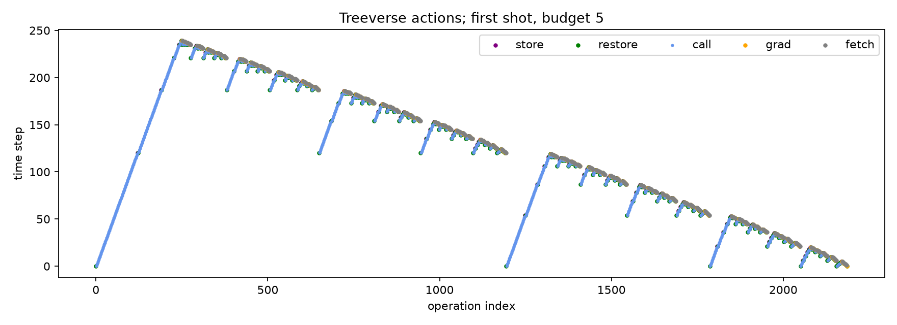

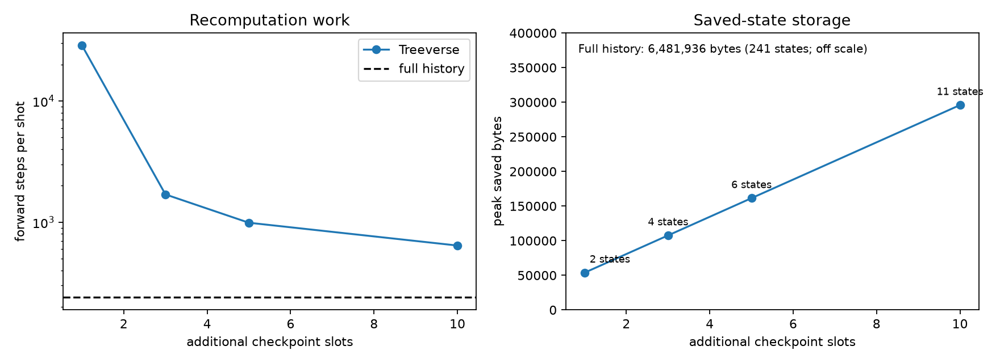

The Marmousi Born run creates `artifacts/marmousi-born/run.json`, `artifacts/marmousi-born/result.json`, and local-only `artifacts/marmousi-born/born_data.npy`. The checkpointed reverse run creates `artifacts/marmousi-image/run.json`, `artifacts/marmousi-image/result.json`, local-only `artifacts/marmousi-image/image.npy`, and **nine** action files `artifacts/marmousi-image/actions-0.json` through `actions-8.json`. The plotting script creates `artifacts/marmousi.png` and `artifacts/verification.json` (the complete numerical check report).

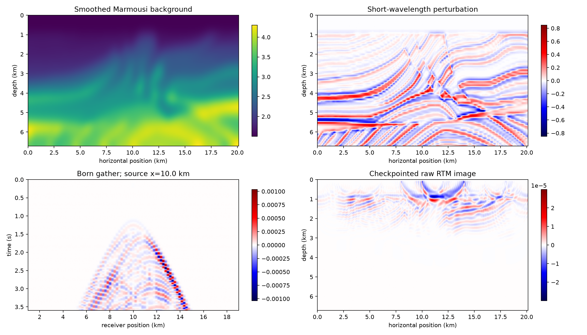

The raw Marmousi image norm is `6.7037740604e-4` (reference `6.7037741e-4`). Its peak saved state count is six, or `20,788,320` bytes; a full trajectory would take about `4.16 GB` per shot and was deliberately not run. The migrated image is `JᵀJm`, not `m` itself: finite bandwidth and limited surface illumination blur the reflectivity, while deep layers receive little wave energy. No depth gain was used on the raw image.

## Why the derivative and replay checks are meaningful

A restart state contains **both** consecutive pressure fields `(u^{n-1}, u^n)`; the next wavefield depends on both. `seismic/src/kernel.rs` defines the single numerical time step. Enzyme generates one local JVP for the Born mode and one local VJP for reverse mode; the surrounding Rust loop composes these derivatives over time. The full-history reverse pass retains all 241 states for the reflector. Treeverse saves selected complete states, restores them, and calls the primal step again to reconstruct the input for a VJP. Those replay calls do **not** add to the image; only `grad` calls do. The action audit checks every reverse step from 239 to 0, validates each restore and the slot budget, while exact image equality across budgets checks that replay preserved the derivative.

As an Enzyme negative control, compiling `seismic/src/kernel.rs` with the pinned nightly **without** `-Zautodiff=Enable` fails with `using the autodiff feature requires -Z autodiff=Enable`. With the flag, the `--smoke` run returns cube value/JVP/VJP `[8, 12, 12]` at input 2. These are independent checks that the derivative wrappers are compiler-generated, not stubs.

## Exact committed evidence inventory

Every evidence file is below beside its producing command or script (the full commands are shown in the corresponding sections above). `.npy` arrays remain local and are regenerated by those same commands.

| Producer | Evidence files |
|---|---|
| `uv run python scripts/ad_experiment.py` | `artifacts/ad/derivatives.json`<br>`artifacts/ad/grad-graph.png`<br>`artifacts/ad/graph.png`<br>`artifacts/ad/modes.png`<br>`artifacts/ad/scaling.json`<br>`artifacts/ad/scaling.png` |
| Forward `seismic` command | `artifacts/forward/result.json`<br>`artifacts/forward/run.json` |
| Born `seismic` command | `artifacts/born/result.json`<br>`artifacts/born/run.json` |
| Full adjoint `seismic` command | `artifacts/adjoint/result.json`<br>`artifacts/adjoint/run.json` |
| Treeverse `--checkpoints 1` command | `artifacts/checkpoint-1/actions-0.json`<br>`artifacts/checkpoint-1/actions-1.json`<br>`artifacts/checkpoint-1/actions-2.json`<br>`artifacts/checkpoint-1/result.json`<br>`artifacts/checkpoint-1/run.json` |
| Treeverse `--checkpoints 3` command | `artifacts/checkpoint-3/actions-0.json`<br>`artifacts/checkpoint-3/actions-1.json`<br>`artifacts/checkpoint-3/actions-2.json`<br>`artifacts/checkpoint-3/result.json`<br>`artifacts/checkpoint-3/run.json` |
| Treeverse `--checkpoints 5` command | `artifacts/checkpoint-5/actions-0.json`<br>`artifacts/checkpoint-5/actions-1.json`<br>`artifacts/checkpoint-5/actions-2.json`<br>`artifacts/checkpoint-5/result.json`<br>`artifacts/checkpoint-5/run.json` |
| Treeverse `--checkpoints 10` command | `artifacts/checkpoint-10/actions-0.json`<br>`artifacts/checkpoint-10/actions-1.json`<br>`artifacts/checkpoint-10/actions-2.json`<br>`artifacts/checkpoint-10/result.json`<br>`artifacts/checkpoint-10/run.json` |
| Marmousi Born `seismic` command | `artifacts/marmousi-born/result.json`<br>`artifacts/marmousi-born/run.json` |
| Marmousi Treeverse `seismic` command | `artifacts/marmousi-image/actions-0.json`<br>`artifacts/marmousi-image/actions-1.json`<br>`artifacts/marmousi-image/actions-2.json`<br>`artifacts/marmousi-image/actions-3.json`<br>`artifacts/marmousi-image/actions-4.json`<br>`artifacts/marmousi-image/actions-5.json`<br>`artifacts/marmousi-image/actions-6.json`<br>`artifacts/marmousi-image/actions-7.json`<br>`artifacts/marmousi-image/actions-8.json`<br>`artifacts/marmousi-image/result.json`<br>`artifacts/marmousi-image/run.json` |
| `uv run python scripts/verify_and_plot.py` | `artifacts/adjoint/image.png`<br>`artifacts/adjoint/wavefield.png`<br>`artifacts/checkpoint-actions.png`<br>`artifacts/checkpoint-work.png`<br>`artifacts/forward/echo.png`<br>`artifacts/forward/gathers.png`<br>`artifacts/forward/wavefield.png`<br>`artifacts/inputs.png`<br>`artifacts/marmousi.png`<br>`artifacts/verification.json` |
